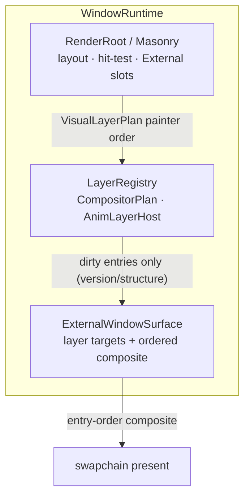

# Runtime architecture

Picus keeps Bevy as the application scheduler and owns one retained runtime per
window. `MasonryRuntime` is a non-send resource containing the window runtimes;
each `WindowRuntime` owns the retained view state, action sink, hit-test state,
and paint bookkeeping for one Bevy window. The primary window is attached
automatically. Additional windows attach when their `Window` entity is seen.

The normal frame flow is:

```text
PreUpdate   input, retained routing, action dispatch
Update      application systems and state changes
PostUpdate  projection invalidation, synthesis, retained rebuild, IME sync
Last        paint and present for each attached window
```

Paint errors are captured as diagnostics. A frame is marked painted only after
`present()` succeeds, so a failed presentation cannot make later lifecycle
logic assume that pixels reached the window. Window size sent to the retained
runtime is logical size; pointer hit testing uses the event window's physical
cursor position.

Fonts registered through `AppPicusExt` are queued in `XilemFontBridge` and
broadcast to every attached window. A window that attaches later replays all
already registered font bytes. Theme backdrops are explicit: the application
can select one with `theme_backdrop`, while an explicit window setting takes
precedence over a stylesheet backdrop.

See [multi-window](../guide/multi-window.md), [i18n and fonts](../guide/i18n-fonts-icons.md),
and [styling and themes](../guide/styling-themes.md) for application-facing
configuration.

### 四条时间线 (four timelines)

The long-term frame architecture separates four independent timelines so that
animation clock, scene build, and present freshness are no longer one OR-coupled
path. Full plan: [plans/frame-pipeline.md](../plans/frame-pipeline.md).

| Timeline | Role | Trigger | Drop policy |
|----------|------|---------|-------------|
| **A Input/Shell** | Pointer, keyboard, move/resize message pump | Events | Do not drop messages |
| **B Anim clock** | Advance `t`, opacity, cursor blink timers | Logical clock (may be 60–120 Hz) | State may jump |
| **C Scene build** | Rewrite + build/encode scene (today: full window; target: painter-order entries) | Only when corresponding content changes | Uncommitted work may merge |
| **D Present** | Submit the latest ready composite | Display path | Mailbox drops stale; FIFO may only backpressure |

**Today (Phase 1 / 1b + P2b infrastructure)** each window's paint path runs through an
internal `FrameDriver` (`picus_core::runtime::frame_driver`, not on the app facade).
`paint_masonry_ui` → `WindowRuntime::step_frame`, which uses
`FrameDriver::decide_entry` / `decide_present` (there is no `FrameDriver::step`).
`DirtyBudget` aggregates `FirstPaint`, `InputOrRebuild`, `LayoutRewrite`,
`ResizeMetrics`, `AnimPaint { layer }`, `AnimTick`, `CompositorPlan`,
`ThemeOrFont`, `RetrySurface`. Decision flags record intent; rewrite+encode+present
stay coupled on the content path. Single-`CachedScene` plans use full-window
`render_frame`; multi-entry plans use ordered `render_ordered_frame` (encode only
version/structure-dirty entries). Sticky content dirt (`resize_dirty`,
`retry_dirty`, `theme_or_font_dirty`, entry dirty flags, …) is cleared **only after
successful present**.

**Hard rule (G5):** `ResizeMetrics`, `InputOrRebuild`, `FirstPaint`, and
`RetrySurface` are **never** skipped by the anim present throttle. Continuous
widgets (e.g. Spinner) may still full-window encode this phase; scheduling
semantics are correct so interaction/resize redraws are not blocked.

A **transitional** pure-animation present throttle (~30 Hz default; override
`PICUS_ANIM_PRESENT_HZ` with a positive Hz, or `0` / `off` / `none` / `false` to
disable) reduces DWM drag ghosting. That throttle is **not** the end state; it is
removed only after layered anim encode gates pass (G10). Anim tick and present
are **not** inseparably tied: pure `AnimTick` may skip encode/present while
keeping the event loop awake. Non-G5 content co-occurring with the anim clock
(e.g. `LayoutRewrite` + `AnimTick`) may also be delayed by the interval.

**PresentPolicy (G7):** surface creation negotiates an explicit capability —
`MailboxLatest` (GPU/compositor may replace queued frames) or
`FifoBackpressure` (name covers FIFO / FifoRelaxed / AutoVsync / Immediate
fallbacks that are *not* Mailbox; does not imply every non-mailbox mode is true
FIFO queueing). `LatestReadyQueue` is a **helper** for CPU-side latest-only
coalescing of *unsubmitted* frames (unit-tested; **not yet on the hot present
path** — present remains single in-flight submit). Submitted FIFO frames are
**not** claimed withdrawable. There is no fake unified `drop_stale` boolean
across modes. Runtime logs mode + strategy at surface init. Shared helper:
`picus_surface::select_present_mode` / `PresentPolicy::negotiate`.

**Observability:** set `PICUS_FRAME_TIMING=1` for per-window phase averages and a
monotonic `frame_id` (`input_dispatch_ms`, `anim_tick_ms`,
`scene_build_base_ms` / `scene_build_anim_ms`, `surface_acquire_ms`,
`encode_*_ms`, `composite_ms`, `present_submit_ms`, `presented` /
`anim_tick_only`). These are **CPU submit-path** times — not displayed-frame
latency.

**Phase instrumentation honesty:** `anim_tick_ms` includes rewrite that Masonry
performs inside `AnimFrame`. `scene_build_base_ms` is only the subsequent root
`redraw()` call. Present-path averages (`encode_*`, `composite`,
`present_submit`, …) and process `paint_ms` / `present_ms` are over **content
paint attempts** (`frames − anim_tick_only`), not diluted by throttled
anim-only zeros. Process log `frames` counts **per-window paint attempts**; ECS
averages use `bevy_frames`. Idle pure-`Skipped` paint does not assign `frame_id`s
but still flushes process summaries on a ~1s wall clock.

Windows baselines require PresentMon/ETW; protocol and result template:
[perf/frame-pipeline-baseline.md](../perf/frame-pipeline-baseline.md).

### Bevy redraw semantics (Phase 1b)

After each window `step_frame`, the host returns an internal **`RedrawDemand`**
(not on the app facade):

| Flag | Meaning | Typical sources |
|------|---------|-----------------|
| `need_anim_tick` | Timeline B — schedule another Bevy frame so the anim clock can advance | `needs_anim_frame`, `render_root.needs_anim()`, throttled pure-anim skip |
| `need_content_present` | Timeline C/D — content encode/present still owed | `needs_redraw`, `resize_dirty`, `retry_dirty`, `theme_or_font_dirty`, rewrite passes |

`paint_masonry_ui` OR-merges demands across windows and writes a single Bevy
`RequestRedraw` **only when either flag is set** (ContentPresent **or** AnimTick
scheduling). Classification is unit-tested (Failed present never sets
`need_content_present`; throttled AnimPaint stays anim-only and does not
escalate to `InputOrRebuild`).

#### Relationship to `WinitSettings` reactive mode

`run_picus` installs latency-bounded reactive updates when the app has not
already inserted `WinitSettings` (`bevy_winit`):

- focused: `UpdateMode::reactive(~1/120 s)` — wake on window/device/user events,
  `RequestRedraw`, or the wait timeout
- unfocused: `UpdateMode::reactive_low_power(~1/30 s)` — ignores pure device
  motion; still wakes on window/user events and `RequestRedraw`

Implications:

1. **Idle UI sleeps** until input, resize, proxy wake, timeout, or Picus
   `RequestRedraw` — we do **not** use continuous/game mode by default.
2. **Any** `RequestRedraw` (anim-only or content) runs a **full Bevy schedule**
   (`PreUpdate` → `Update` → `PostUpdate` → `Last` paint). Bevy has no public
   “paint-only / Last-only” update path; Phase 1b therefore **classifies**
   demand but does **not** skip the system table for pure `AnimTick`.
3. Tradeoff (P1b.2): avoiding full empty spins on anim-only wakes would need a
   custom winit integration or a dedicated anim timer outside the full schedule
   — deferred; measurable today is correct wake **reason** and no Failed/content
   redraw loops.
4. Two layers stay separate: (a) content stickies set `need_content_present` so
   Bevy **wakes** (a `RequestRedraw` is written and not dropped); (b) G5 dirty
   reasons (`FirstPaint` / `InputOrRebuild` / `ResizeMetrics` / `RetrySurface`)
   still force **unthrottled encode/present** on the FrameDriver path. Wake
   demand alone does not imply G5: e.g. rewrite-only content demand can still
   hit the transitional LayoutRewrite+AnimTick present throttle while Bevy is
   awake.

App public API remains `run_picus`; `FrameDriver` / `RedrawDemand` stay internal.

### Masonry layer contract (Phase 2a hard gate)

Before multi-texture composite (P2b), Picus freezes the Masonry boundary. Source of
truth for the inventory and selected interface:
`picus_core::runtime::layers` (crate-private; not on the app facade).

#### Gate questions and results (xilem rev `4b1922c`)

| # | Question | Result |
|---|----------|--------|
| 1 | Can `PaintLayerMode` / `VisualLayerPlan` yield **self-contained, independently renderable** painter-order entries under ancestor clip/scroll, transform, ZStack, overlay? | **No for product isolation.** Empirical FAIL on: (a) **sticky isolation** — mode resets to Inline each pass; clean widgets drop IsolatedScene/**External** on next redraw; (b) **missing clip package** — `VisualLayer` is only `kind` / `transform` / `widget_id` (External adds `bounds`); no ancestor clip-chain field; (c) flatten helpers **skip** External. **Not separately spiked:** scroll portals, ZStack front/back, Masonry overlay `layer_root_ids` stack — FAIL still stands without those spikes because isolation is non-sticky and layers lack clip metadata. Transforms bake into scene/local space when a split *does* occur. No persistent compositor `LayerId` (checklist; upstream FIXME). |
| 2 | Can an anim tick emit **only the changed anim entry** without full-tree `RenderRoot::redraw()` and without reassembling base scene? | **No.** Public path is only full `redraw()` → paint pass. Consecutive redraws always reassemble a full plan. Per-widget `scene_cache` may skip re-recording clean widgets; that is not selective layer rebuild. |

**Evidence classes** (see `MasonryLayerCapabilities` / `CapabilityEvidence`): sticky
isolation, External slot/skip/collapse, clip type-shape, and full-redraw reassembly are
**empirical spikes**. `persistent_layer_id: false` is an **inventory checklist** bit
(re-audit on pin bump).

**Forbidden reading:** classifying a post-hoc `VisualLayerPlan` as “per-layer scene
build” is incorrect. The plan is a full-pass painter-order snapshot; selective work
must be owned by Picus dirty sets, not by slicing the plan after the fact.

#### Selected path

**Picus `AnimLayerHost`** (not “wait for upstream only”):

- **Masonry:** layout, hit-test, painter-order **`PaintLayerMode::External`** placeholders
  (widget must call `set_paint_layer_mode(External)` **every paint** — mode is not sticky;
  host registration alone does not set mode).
- **Picus host:** independent anim entry state (`AnimLayerId`, bounds, transform, version, dirty).
- **Composite (P2b infrastructure):** exact painter-order composite of
  `CompositorEntryKind::{CachedScene, Anim, Overlay, External}` via stable Picus
  `LayerId`s — **not** a fixed Base→Overlay→Anim stack. Cached segments may appear
  both before and after an anim/external slot.

**Upstream revision strategy (parallel, non-blocking):** track/contribute persistent
upstream `LayerId`, sticky isolation, self-contained clip/effect on isolated layers, and selective
layer redraw. If a future pin gains
`MasonryLayerCapabilities::supports_upstream_only_anim_isolation()`, Picus may
narrow the host; composite does not wait on that.

**Failure fallback:** single-`CachedScene` plans still use the Phase 1 full-window
encode path; transitional anim present throttle remains until G2 vertical slices
pass (P2c+). Never claim VisualLayerPlan classification as isolation.

#### Ownership / lifecycle (P2b infrastructure)

`LayerRegistry` (plan + `AnimLayerHost`) is a field on `WindowRuntime`.
`step_frame` rebuilds a painter-order `CompositorPlan` from each
`VisualLayerPlan`. GPU intermediate textures live in `picus_surface`
(`render_ordered_frame`), keyed by `LayerId::raw` and gated by
`LayerMetricsGeneration` (resize/DPI drops all targets atomically — never mix
old-size textures with a new plan).



```text
# Current P2b + P2c contract

rebuild_from_visual_plan(plan)  → CompositorEntry[] in Masonry painter order
register_external_widgets_from_visual → AnimLayerId only for Spinner-typed External
needs_encode                    → structure_dirty || encoded_version != content_version
non-anim content dirt           → mark_non_anim_content_dirty bumps CachedScene/Overlay
                                  (InputOrRebuild/Theme/Layout/…; pure AnimPaint does not)
Spinner paint                   → PaintLayerMode::External every paint; host scene via paint_arms
phase gate                      → 12-step visual phase only → request_paint / host version
pure AnimPaint (G2)             → skip full redraw; sync host scenes; encode Anim only
encode                          → only needs_encode entries; others reuse texture
present success                 → mark_encoded + clear host dirty (sticky)
present fail/retry              → retain dirty (no permanent spin beyond Phase 1 rules)
resize/DPI                      → metrics_generation++ from surface.physical_size();
                                  drop all layer targets; FirstPaint-all
alpha / Mica                    → layer targets straight-alpha; when present needs premul,
                                  intermediate is held premul (layer0 convert + src-over,
                                  final replace) so semi-transparent upper layers are correct
```

#### Spinner + indeterminate ProgressBar anim entries (P2c / P2d / G2 progress)

Product path for continuous isolation (no gallery/entity hardcode):

1. **Widget paint** sets `PaintLayerMode::External` every paint when isolation
   applies (mode is not sticky):
   - **`Spinner`:** always External.
   - **`ProgressBar`:** External **only while** `progress == None`
     (indeterminate). Determinate (`Some`) paints inline into the cached scene
     and does **not** keep a permanent anim tick.
2. **`LayerRegistry::register_external_widgets_from_visual`** promotes External
   slots to Anim **only when a host painter exists** (type downcast:
   `Spinner`, or indeterminate `ProgressBar`). Other External stays
   `CompositorEntryKind::External` (transparent placeholder) — never an empty
   Anim with silent missing content. Host slots for widgets that leave External
   (e.g. ProgressBar `None→Some`) are pruned.
3. **Host scenes** (FullWindowTransparent target):
   - Spinner: `AnimLayerHost::sync_spinner_scene` via `Spinner::paint_arms`;
     version / dirty advance only when the **12-step visual phase** changes
     (or geometry/first build).
   - Indeterminate ProgressBar: `sync_progress_indeterminate_scene` via
     `ProgressBar::paint_indeterminate_segment` (segment width = 30% of track,
     `left = phase×1.3 − 0.3`, rounded-track clip; **theme `BarColor` /
     border metrics only** — no production brand defaults). Continuous
     `indeterminate_phase ∈ [0,1)` over a **1.2s** logical period gates version
     (large jump frames allowed via rem_euclid).
4. **Steady anim ticks (G2):** when dirty is only `AnimTick`/`AnimPaint`, the
   window has already painted once, the plan has Anim entries, **no sticky
   `base_invalidated`**, **no rewrite pending**, and **no CachedScene/Overlay
   needs encode** after metrics notify, `step_frame` **skips** full-tree
   `redraw()` and base reassembly. Widget phases are acked only after
   **successful present** (`ack_anim_phases_after_present`; host dirty is
   always re-merged into post_dirty so Failed present still retries encode).
   Phase-unchanged ticks skip encode/present once acked. Metrics/size changes
   force full path (never encode empty base with `visual=None`).
5. **Rewrite during AnimFrame:** if rewrite was pending before the tick (and
   completed) or still pending after, set sticky `base_invalidated` +
   `InputOrRebuild` (unthrottled) until a **full-path** present succeeds —
   anim throttle cannot drop base reassembly (Issue 10). Host geometry moves
   on selective sync also force full path (Issue 11 partial).
6. **Content / resize / first paint** still full-redraw; bound External widgets
   are re-`request_paint_only` so External mode sticks for the paint pass.
7. **ProgressBar lifecycle (P2.13):** `Some→None` resets elapsed/phase to 0,
   invalidates, starts anim; `None→Some` stops further anim requests and
   invalidates; determinate must not retain a permanent tick. Accessibility
   reports numeric value only when determinate (None is not a fake number).

**Known limitation (not G3 under scroll/clip):** host anim scenes use
`AncestorClip::none` and do not yet re-apply ancestor clip/scroll packages.
Anim widgets under a clipped portal/scroll may paint outside the ancestor clip
on the FullWindowTransparent anim target until clip plumbing lands.

**Not yet (do not overclaim):**

- Removing transitional ~30 Hz anim present throttle (G10 / P2e)
- Full PresentMon/ETW G4 drag protocol run (documented in
  [perf/frame-pipeline-baseline.md](../perf/frame-pipeline-baseline.md); not
  required for this vertical slice)
- Claiming product G2/G3/G4 complete without PresentMon data — layer-contract
  unit tests cover Spinner + indeterminate ProgressBar host paths

#### Anim target choice (size gate input)

| Strategy | Encode shape | First composite? |
|----------|--------------|------------------|
| **Full-window transparent** anim target; only anim widgets paint | Full-window clear of anim RT; sparse scene | **Yes** (selected; Spinner P2c / ProgressBar P2d) |
| Widget-bounds / atlas | Smaller encode; more bookkeeping | Deferred (P4 / if G3·G4 fail) |

Rationale and budget assumptions:
[perf/frame-pipeline-baseline.md](../perf/frame-pipeline-baseline.md) §6.

#### Timing (P2.5 + P2c + P2d)

`PICUS_FRAME_TIMING=1` continues to report per-window `frame_id` with
`scene_build_base_ms` / `scene_build_anim_ms` / `encode_base_ms` /
`encode_anim_ms` / `composite_ms`. Ordered path attributes non-anim entry
encodes to `encode_base` and `OrderedEntryKind::Anim` to `encode_anim`.
On pure-anim Spinner / indeterminate ProgressBar frames, `scene_build_base_ms`
is 0 and `scene_build_anim_ms` measures host scene sync; `encode_base` should
stay 0 when only Anim entries `needs_encode`. These remain **CPU submit-path**
times.

### Frame pipeline evolution

Implementation plan and success metrics G1–G10:
[plans/frame-pipeline.md](../plans/frame-pipeline.md).
